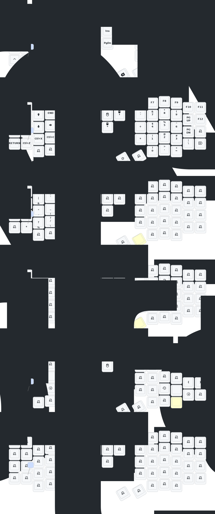

# Sofle

- [Chinese](README.md)
- [English](README_EN.md)
## Usage

Fork of the ZMK Eyelash firmware most aliexpress sellers use, just with my own keymap. Feel free to grab if you want my layout for some reason - pictured below.

If you want to flash it, grab the firmware files from the latest build in the "Actions" tab. For each side, plug the side into USB and double tap the button on the back of the board. You should have a USB drive that is the keyboard connect. For both, copy over the "settings_reset" file - once it loads the USB drive will go away. Double tap the button again. For the left side, paste in eyelash_sofle_studio_left.uf2. For the right, paste in nice_view_custom-eyelash_sofle_right-zmk.uf2.

If you flash your device you do so at your own risk. Make sure you have backup firmware in case this is not compatible with your board.
## Update List

- 2024/12/21
  1. Added support for zmk-studio (just refresh the left hand to use).
- 2024/10/24
  1. Modified power supply mode to reduce power consumption.
  2. Fixed the automatic shut-off feature for RGB power supply.
- 2025/8/22
  1. update the soft off.When you press the keys Q, S and Z simultaneously and hold them for 2 seconds, the keyboard will enter a deep sleep state and cannot be awakened by pressing the keys. This function can be used when carrying it outside. The activation method is to press the reset switch once.
  2. This month, I also updated the ultra-thin versions of the corne and sofle cases. The frame and base plate have been thickened, and the opening of the reset switch has been adjusted, so that the reset switch can be easily pressed. At present, we are still conceptualizing how to design the shell with an inclined bracket.If you have carefully examined a PCB, you will notice that there are reserved interfaces for expansion IO. I wonder if anyone has been able to utilize them,I will try it！
  3. The GIF animations on the right-hand keyboard screen have been removed, which will significantly reduce the power consumption of the right-hand keyboard.

> If your  sofle was updated before 2025/8/22, please update to the latest firmware.
>

## Contact Me

For 3D printed model files or any issues and malfunctions with the keyboard, please contact [380465425@qq.com](mailto:380465425@qq.com)

## Keymap editor
https://nickcoutsos.github.io/keymap-editor/

## Sofle Keymap

